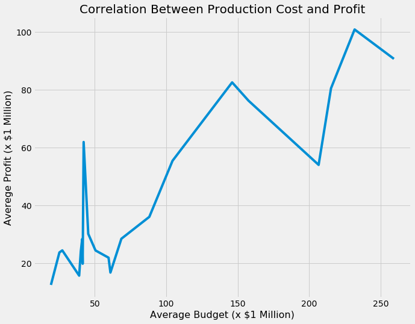
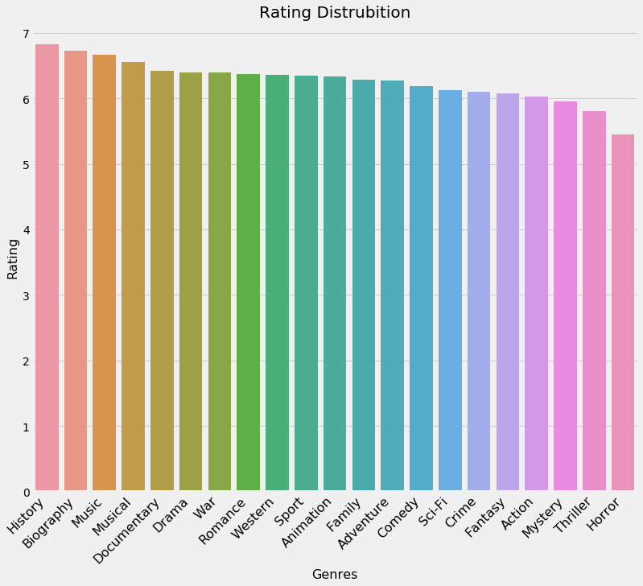

# Movie Trends Analysis Report

by Nadir Sarigul

This report contains a detailed explanation of the extraction, cleaning and analysis of data collected between 2010-2019 on movie trends. This report is based off data from Box Office Mojo, IMDB, Rotten Tomatoes, TheMovieDB and The Numbers provided by Flatiron.

## I. Overview

Microsoft aims to create a new movie studio. In order to help Microsoft making the decision of what type of movies they should focus on in order to create a solid and profitablem I have performed analysis of existing data that reflect movie trends over the past decade. Here, I make recommendations about: 
    
 1) The type of movies are more popular and more profitable to produce 
 
 2) The best time to release the movies produced
 

## II. Structure of Repository

* PNG files -- Image files linked to README
* Data_preparation.ipynb -- Code for preparing and cleaning the data
* data_modeling -- Code for data modeling and visualization
* zipped data -- Original data files from Flatiron used in the analysis
* README.md

    
## III. Business Problem
 
Central Question: What type of movies should Microsoft create in order to establish a prolific and lucrative movie studio?
 
To answer this question I have divided this analysis in several different sub-questions aimed at understanding the state of the current movie market and how the different movie genres perform both in populatity and in profit over the last decade. Sub-questions addressed by this analysis:
 
 1) What movie genres are the most produced?
 
 2) Which movie generes have the higest budget and profit?
 
 3) What is the margin of propfit for the highest earners genres?
 
 4) What genres are the most well rated?
 
 5) Is there a relationship between ratings and profit margins?
 
 6) What time of the year is best to release movies?
 
 
     
 ## IV. Data Understanding
 
Considerations about the data utilized:

 * All domestic movies and movies without production budget or worldwide gross revenue information were excluded
 * A total of 1754 movie entries was utilized in the analysis described in this report
   
In order to answer the questions above, which are focused on undertanding which movie genre is likely to yield more success for Microsoft new movie studio, I have used the datasets provided by flatiron (described above) to create a dataframe that contained all the pertinent information for my analysis. I have decided to focus just on worldwide data, as the main driver of revenue of a susscessful movie studio is the worldwide audience. 

To create this dataframe I have merged the relevant tables (detailed description of my process to generate this dataframe is below under Data Preparation) such that I would have information about the movie budget, worldwide gross earnings, ratings, genre and date of movie release. I utilized this dataset to predict the trends of the target variable (movie genre) based on fiancial as well as quality/popularity metricts available in the datasets. 

## V. Data Preparation

After careful exploration of all datasets made available to me by flatiron, I decided to focus my analyis on data extracted from 4 of the different datasets To prepare the dataframe necessary for this analysis I took a few different steps aimed at cleaning and organizing  and integrating the relevant data:

### 1) Datasets imported: 

* "tn_movie_budget"

* "imdb_title_basic"

* "tdmb_movies"
            
### 2) Cleaning and preparation of finantial-related data:

* The finantial information utilized in this analysis was extracted from "tn_movie_budget" dataset

* In this dataset I first started by making sure that all the data available here was in the right format to enable subsequent analysis. To achieve this goal, I transformed the data type for the variables "production budget", "domestic gross" and "worldwide gross" from strings (the original format of the data) to intergers.

* To facilitate the data analysis I created a new table which I named "budgets" that contains only the variables of relevance for this analysis ("movie", "production_budget","domestic_gross", "worldwide_gross") by using the copying function from the original "tn_movie_budjet" 

* To have a direct metric of the profit made in each genre, I calculated the profit for each entry in this data set by subtracting the "budget" from "worldwide gross" and removed the entries with negative profit values from the dataset. This metric was added to the "budgets" table.

* I also calculated the profit margin for each entry in this dataset, as this metric allows for a better understanding of the profitability of each genre. To avoid the creation of non-values in the profit margin variable, I added a very small number (0.0001) in my formula to calculate the profit margin. The addition of this small value has no impact in the outcome of the analysis but avoids the creation of non-values which cause problems down the line with the analysis of the data. This metric was added to the "budgets" table. 

### 3) Cleaning and preparation of ratings-related data:

* The ratings information utilized in this analysis was extracted from "imdb_title_basic"and "tdmb_movies" datasets.

* To prepare the "imdb_title_basic" dataset for posterior utilization I removed the entries that did not have a genre associated with it .

* To create a more complete dataset that compiles information on ratings, year of release and genre for each movie entry, I merged the "tdmb_movies" dataset with the modified version of "imdb_title_basic" (described above) dataset. To achieve this I used the left merge operation having "original_title" as the metching key for the merge. This merged dataset was stored under the name "tdmb_imdb_title". 

* To facilitate the data analysis I created a new table which I named "tdmb_imdb" that contains only the variables of relevance for this analysis ("popularity", "release date","title", "vote_average", "vote_counts", "runtime_minutes", "genre") by using the copying function from the "tdmb_imdb_title" dataset.
            
### 4) Creation of main dataset for modeling and data visualization:

* The first step I took towards incorporating the finantial dataset with the ratings dataset was making sure that all variables in each dataset were ready to merge. To achieve this I changed the name of the colum "title" in the tdmb_imdb" datatset to "movie" to match the label of the "budgets" table.

* Once the datasets were appropriate for merging, I merged the "tdmb_imdb" with the"budgets" datasets using the inner join function and "movie" as matching key. This operation allows to get only entries for "movies" that have data in both tables. After merging, I further cleaned this new dataframe by dropping all null values and duplicates (again using "movies" as the directing entry.

#### Through the processes described above I created a new dataset which contains all the information that I need to answer the questions outlined above, which will be used as my dataframe for the data modeling and visualizations shown below. 
            
            
 ## VI. Data Modeling and Evalution 
 

### Understanding the movie market

#### 1) What movie genres are mostly produced?

This analysis demonstrates that the genre with most movies produced is Drama produced followed by Comedy  and Action, while the least produced movie genres are Music, Westerns and War movies. It is important to note that the different in number of Drama movies to the second largest genre (Comedy) is substantial with Drama movies being produced 39.2% more than Comedy movies. 

#### 2) Which genres have the highest production costs?

Analysis of the money spent to produce movies by genre reveled that Adventure and Animation (which are two of the most produced movie genres)as well as Fantasy are the most expensive to produce while Documentary, Horror and Music are the cheapest genres to produce. It is interesting to note that Drama, which is the most produced genre, has an average production cost of about 25% of the production costs of Adventure and Animation movies.

#### 3) Which genres have the highest profit?

Looking at the profit that each movie genre generated it is clear that Animation, Adventure and Sci-Fi movie genres are the ones that generate more revenue. On the other hand the genres with lowest production costs such as Horror and Documentaries also have the lowest revenue. It is also interesting to point out that Drama movies while being the most produced type of movies and having a relatively low average production costs also has relatively low profit, suggesting that production costs may correlate with the profit potential for each genre. 

#### 4) Does production costs correlate to profit?

Correlative analysis of how production costs and profit relate to each other show a strong positive correlation (r=0.88) between the production costs and the profit generated in  each movie genre, suggesting that the more a movie studio spends on making a movie the more profit the movie makes. 

#### 5) What is the profit margin in each genre?

Using this metric, my analysis shows that Animation, Mystery and Adventure are the movie genres with the higest profit margin and War and Western genres the ones with the lowest profit margin. 

#### 6) How does the profit margin correlate with the production costs?

Because profit margin is expressed as a percentage rather than a dollar amount, it is possible to compare the profitability of the movie genres independently of their production costs and therefore it is a more robust measure of finantial success of specific movie genres. Through this analysis we can see that unlike what happens with profit and production costs, there is no correlation between profit margin and production costs (r=0.36) indicating that there might be some other genres that do not have high productions costs or high dollar amounts in profit do have high profit margins. 

To better understand these relationships, I directly compared the profit, profit margin and production costs for each genre. Thought this analysis is clear that some movie genres that I previously discarded because they did not have high dollar amount in return are very profitable, while others that have higher dollar amounts in profit are not as profitable investments. For instance movies in the music genre despite having a very low production costs (60.98M dollars) have a high profit margin returning decent profit on the investment (60.98M dollars profit)indicating that this genre might be a good business opportunity despite not returning the absolute highest dollar amounts. Moreover Biography movies also display a good profit margin (39.46%)while requiring low investment in production costs. On the other hand, this analysis shows that Western movies despite having a considerable production cost (61.95M dollars) have a very low profit margin (12.24%) and are likely to not be good investments for a new movie studio. 

### Understanding movie trends

In addition to finantial considerations, how a movie is received by the audience also influences the general success of a movie producing studio as well as the general "brand" of the studio. To get some insights into what genre of movies are more well received by the audience I have performed some analysis aimed at determining what genres are better received, how their rating affects the profit margin and what time of the year is best to release a movie. 

#### 1) What are the genres with best ratings?

A good metric of a movie's sucess is the ratings. Analysis of the average IMBD ratings revealed that the genres with the higest ratings are History, Biography and Music, while the movie genres with the lowest ratings are Mystery, Thriller and Horror. However, it is important to notice that this metric fails to account for the number of votes that yields the rating of the specific movie/genre which can convulute the interpretation of this metric.  Nevertheless this analysis further supports the conclusion that investing in genres such as Music and Biography is a profitable decision, where a significant return can be obtain from a more modest investment. 

#### 2) Is there a correlation between ratings and profit margins?

 

No direct correlation between ratings and profit margins is observed (r=-0.246) suggesting that while ratings are important they do not substantially affect the financial success of a movie. 

#### 3) What is the best time of the year to release a movie?

By analysing the date of release of each movie in my dataframe over the last decade, it is clear that there are two peaks of movie release during the year: a first peak in February to April and a second more wider peak and with more movies released spanning from July to October. 

## VII . Conclusions

Here I reviewed the movie trends from the past decade to make recomendations on what movie genres should Microsoft invest in to start their new movie studio. I focused on worldwide financial metrics as well as how the different movie genres were perceived by the worldwide audience to gain insights into the best movies to produce. Based on this analysis I can make the following recommendations:

* The production of few big Animation and Adventure movies: Animation and Adventure movies while having the higest production costs are also the ones that produce the highest profits. Therefore it is recommended to invest in these genre and produce a few big budget movies as they are likely to return good profits. Howeover an important consideration to take here is that these are big ticket items, and therefore are more risky investments. It is also important to notice that while the overall profit of these genres is high it is likely to be inflated by big blockbuster movies such as the Marvel and Pyrates of the Caribbean movies. This is a type of analysis that I did not cover in this project and that might be important when making the decision of producing big spending Adventure and Animation movies. Therefore some caution is warrented in the production of movies in these genres as they are to some extent high risk high reward.

* The production of Biography and Music movies: While their absolute profits are much lower than Animation and Adventure movies, these type of movies are popular and tend to have high profit margins. They represent safer investments as the production costs are generally low. These type of movies could also help build a brand for Microsoft to carve a niche in the studio business. 

        
* Movies produced should be released either in the beggining of the year or in the summer/fall as those seem to be the most active times of the year for movie releases. An important consideration to have here is which distribution peak is better for specific movie genres as this can provide additional clues on when to release specific movies. For instance the first peak of movie releases in February-April is likely linked to Valentine's day while movies released later in the year are better candidates for Award nominations. 

